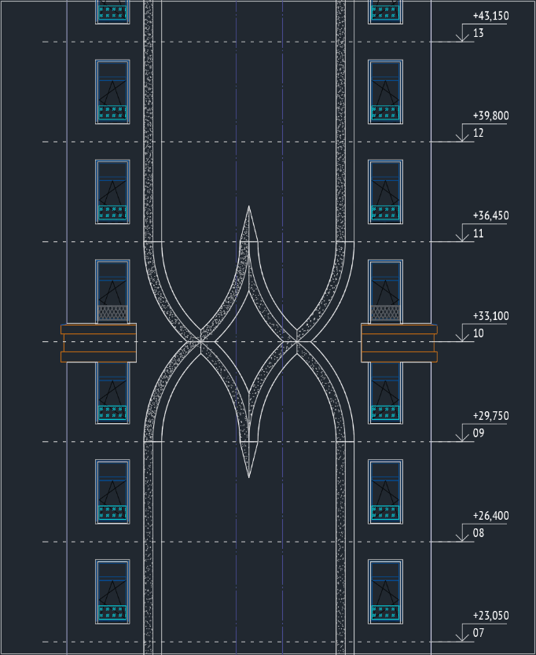
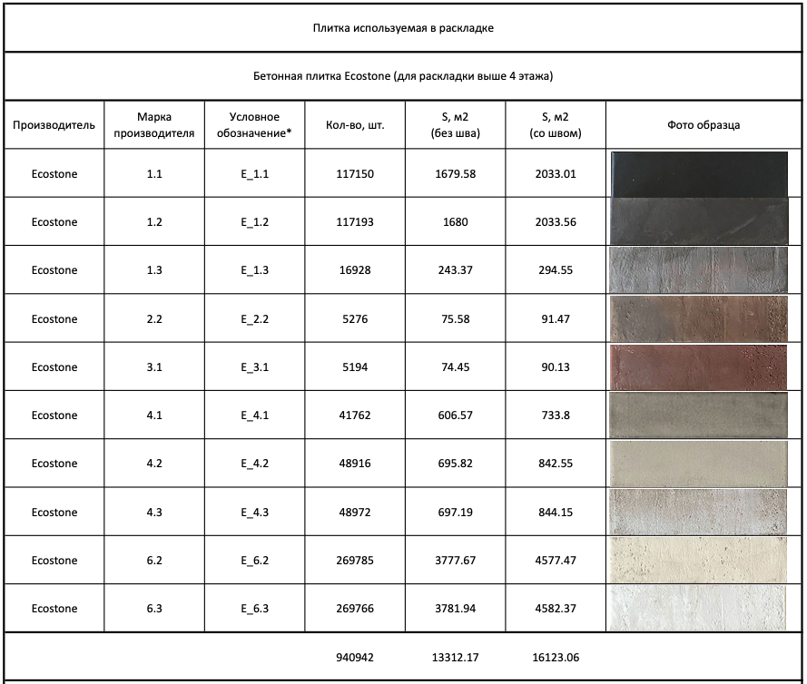

# brick_layout_automation
## Проект по автоматизации градиентной раскладки кирпича

Выполнен для компании [Sminex](https://www.sminex.com/) в рамках разработки проекта жилого комплекса ["Достижение"](https://dom-dostigenie.ru/)

## Задача
- Автоматизировать процесс градиентной раскладки кирпича состоящей из десяти марок различного цвета;
- Составить детальную спецификацию кирпича содержащую:
  - Кол-во шт. каждой марки рядового кирпича;
  - Кол-во шт. каждой марки углового кирпича;
  - Площадь кладки для каждого кирпича с учетом и без учета шва;
  - Спцификация должна иметь возможность получения всех данных на целый дом, отдельно на каждую секцию, отдельно на участки фасадов;
- Автоматизировать подготовку рабочих чертежей с кладочными схемами и маркировкой кирпичей для рабочих;
- Иметь возможность быстро вносить изменения в раскладку с автоматическим обновлением всех чертежей и спецификаций.

## Реализация
Для решения задачи был выбран [Rhino3D](https://www.rhino3d.com/) с модулем Grasshopper3D (это плагин для Rhino 3D, который в том числе позволяет программировать параметрический data-driven-дизайн в 3D, работать с Python и C#).

Этапы работы:
- Разработаны модули выполняющие:
  - раскладку кирпича;
  - маркировку кирпича на чертежах;
  - подсчет количества и обьема кирпича;
  - рендеринга цветовой схемы раскладки чертежа с использованием реальных фотографий образцов кирпича;
  - экспорта данных в csv формат.
- При помощи Power Query из полученных данных сформированы требуемые спецификации;
- Создана связь excel таблиц со спецификациями в AutoCad 

Разработка данного скрипта позволила реализовать данную идею с раскладкой кирпича, исключить человеческий фактор из подсчетов спецификации,так же позволила быстро вносить изменения в параметры раскладки, что без автоматизации было бы невозможным либо очень трудозатратным по времени. 

Фрагмент фасада с результатом работ:

Фрагмент раскладки с маркировкой:

Реализация на фасаде:

Фрагменты разрабтанного скрипта VPL (VPL — visual programming language):

"Фронтент" для работы со скриптом:

Фрагмент "бэкенда" =):

Спецификация (часть):

